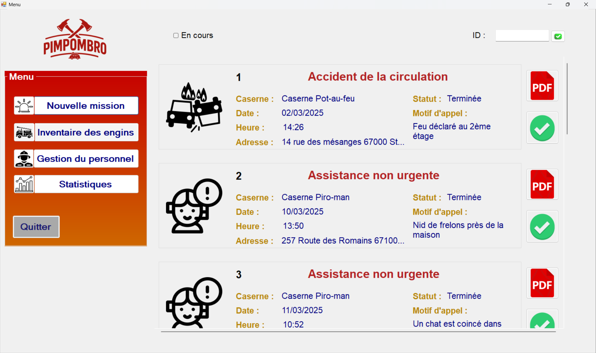
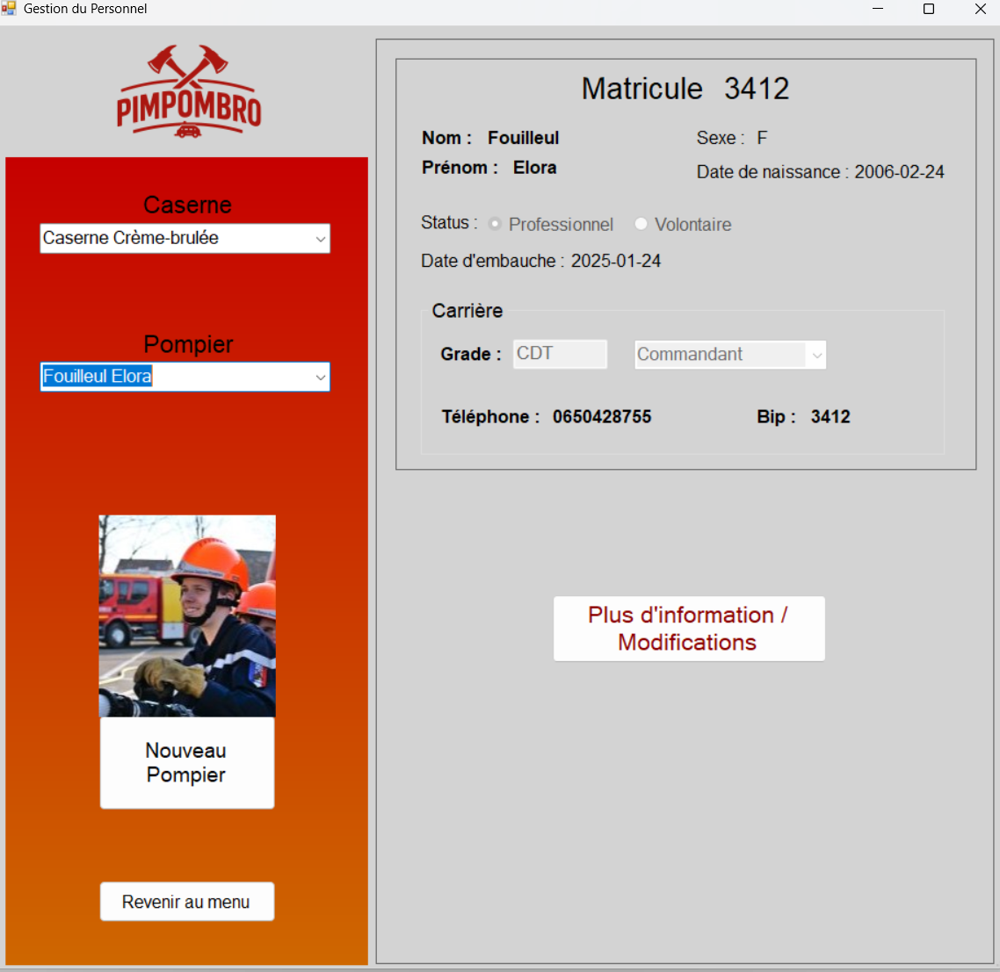

# PimPomBro 🚒

## Description

**Application de gestion d'une caserne de pompiers**, développée en C# avec WinForms.  
Elle permet de gérer les missions, les véhicules, les pompiers et de générer des rapports au format PDF.  

## Aperçu





## Stack Technique

**Langage :** C#  
**Interface :** WinForms (Visual Studio)  
**Base de données :** SQLite  
**Autres :** Génération de PDF  

# Installation & lancement

1. **Cloner le dépôt**
```bash
git clone https://github.com/AmbreRoise/PimPomBro.git
cd PimPomBro
```
2. **Ouvrir le projet dans Visual Studio**

3. **Vérifier que SQLite est installé ou inclus**
- Dans la barre supérieure (onglets) : **Projet > Gérer les paquets NuGet**
- Dans parcourir : **System.Data.SQLite.Core (version 1.0.119)** > installer
- Appuyer sur **Appliquer** lors de la fenêtre pop-up puis sur **J'accepte**

5. **Lancer l’application** (bouton ▶ ou F5)

## Fonctionnalités principales

Certaines parties doivent être réalisée par **liaison de données**, mode connecté ou déconnecté. Certaines modifications de la base de données (update ou insert) doivent être gérée dans une transaction.

- **Volet 1 :** Page d'accueil avec visualisation de missions
- **Volet 2 :** Création d'une nouvelle mission
- **Volet 3 :** Visualisation des informations des pompiers et modifications
- **Volet 4 :** Visualisation de statistiques

### Volet 1 : Page d'accueil

La page d'accueil doit permettre la **visualisation des missions** antérieures (finies) et en cours : sinistre, adresse, date, commentaires, compte rendu.  
- **bouton "terminer une mission"** si elle est en cours
- **génération d'un pdf** récapitulant la mission (qu'elle soit en cours ou non)

### Volet 2 : Création de missions

La création de missions permet de **créer une mission** en renseignant son type de sinistren l'adresse, un commentaire éventuel ainsi que la caserne mobilisée.
- **affectation automatique des pompiers et des véhicules nécessaires** de la caserne sélectionnée s'ils sont disponibles
- si la mission ne peut être affectée à la caserne choisie, il faudra sélectionner une autre caserne
- **affichage final des véhicules et pompiers réquisitionnés**

### Volet 3 : Informations pompiers

La **visualisation des informations par pompier** se fait par le choix du pompier. On affiche son matricule, ses informations personnelles, sa caserne de rattachement et ses anciennes affectations s'il y en a, ainsi que ses habilitations avec leurs dates de passage. Sa disponibilité (en congé) est également indiquée.
- Possibilité de **modifier des informations**
- **Identification nécessaire** par un login et mot de passe administrateur

### Volet 4 : Statistiques

La **visualisation des statistiques** peut se faire par caserne ou à partir de la base de données entière. 
- habilitations les plus utilisées
- l'engin le plus utilisé
- nombre de missions pour un sinistre donné
- tous les pompiers ayant l'habilitation sélectionée
- nombre d'heures d'utilisation de chaque engin de la caserne sélectionée
